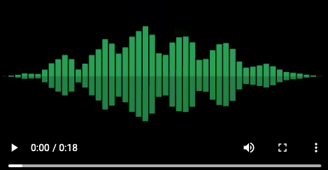

# SeeWav：音频波形动画生成工具 | 适配播客可视化与社交媒体传播
SeeWav可快速为您的音频生成精美波形动画，**特别适用于播客网站制作可视化视频，以及社交媒体内容传播**，让音频内容通过直观的视觉形式更易传播、更具吸引力。

查看演示请点击下方图片：
<p align="center">
<a href="out.mp4">
</a></p>


## 安装
您需要Python 3.7及以上版本。  
您需要安装`ffmpeg`并确保其支持`libx264`（视频编码）和`aac`（音频编码）编解码器，以保证生成的视频符合播客平台及社交媒体的常见格式要求。  
- 在使用Homebrew的Mac OS X系统上，运行`brew install ffmpeg`；  
- 在Ubuntu系统上，运行`sudo apt-get install ffmpeg`；  
- 若使用Anaconda，可运行`conda install -c conda-forge ffmpeg`。


## 使用方法
通过以下简单命令即可快速生成动画，满足播客片段可视化、社交媒体短音频配图等轻量需求：
```bash
uv init --python 3.11
uv add pycairo numpy tqdm
uv run seewav.py test_query.mp3  # 直接生成默认配置的波形视频
```


## 高级配置
支持通过参数自定义动画细节，适配不同播客平台（如小宇宙、喜马拉雅）的展示规格及社交媒体（抖音、视频号、Twitter等）的尺寸/风格需求：
```bash
seewav 音频文件 [输出文件]
```
默认输出文件为`out.mp4`（兼容主流平台的通用格式），可用选项如下：

```bash
usage: seewav [-h] [-r 帧率] [--stereo] [-c 颜色] [-c2 颜色2] [--white]
              [-B 柱形数量] [-O 过采样率] [-T 单帧时长] [-S 过渡速度] [-W 宽度]
              [-H 高度] [-s 起始时间] [-d 持续时长]
              audio [out]

从音频文件生成精美的MP4动画（适配播客可视化与社交媒体传播）。

位置参数:
  audio                 音频文件路径（支持播客常见的MP3、WAV等格式）
  out                   输出文件路径，默认值为./out.mp4

可选参数:
  -h, --help            显示此帮助信息并退出
  -r 帧率, --rate 帧率  视频帧率（建议社交媒体设为24/30fps，播客长视频可设为15fps节省体积）。
  --stereo              为立体声播客生成双声道分离波形，提升视觉层次感。
  -c 颜色, --color 颜色  柱形颜色（格式'r,g,b'，0-1范围），可匹配播客品牌色或社交媒体主题色。
  -c2 颜色2, --color2 颜色2
                        立体声模式下第二个波形的颜色，格式同上。
  --white               使用白色背景（默认黑色），适配浅色模式下的社交媒体展示场景。
  -B 柱形数量, --bars 柱形数量
                        单帧画面中显示的柱形数量（数值越高波形越精细）。
  -O 过采样率, --oversample 过采样率
                        值越低，波形变化越平缓（适合长时播客可视化）。
  -T 单帧时长, --time 单帧时长
                        单帧画面显示的音频时长（秒），影响波形动态速度。
  -S 过渡速度, --speed 过渡速度
                        值越高，帧之间的过渡越快（适合社交媒体短平快内容）。
  -W 宽度, --width 宽度  动画宽度（像素），支持1080px（抖音/视频号）、1920px（播客长视频）等主流规格。
  -H 高度, --height 高度  动画高度（像素），可搭配宽度设置为16:9、9:16等平台适配比例。
  -s 起始时间, --seek 起始时间
                        音频处理的起始时间（秒），方便截取播客精彩片段生成传播素材。
  -d 持续时长, --duration 持续时长
                        从起始时间开始的处理时长（秒），适配社交媒体15s、60s短内容需求。
```